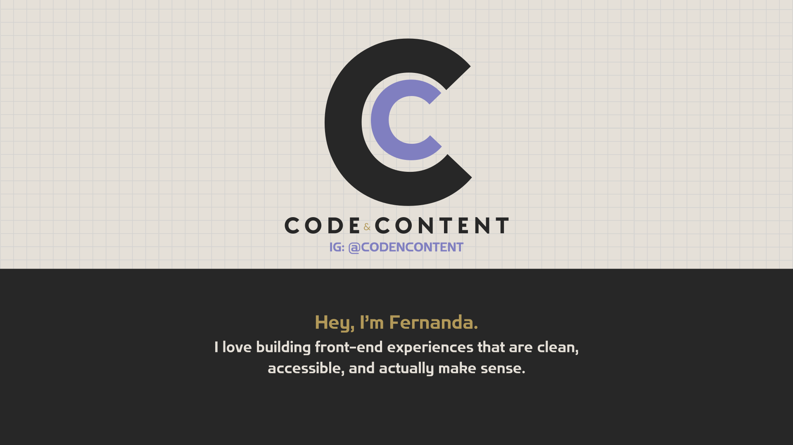

<h1 align="center">Fernanda Rodríguez</h1>
<h3 align="center">👩‍💻 Front-End Developer | UX/UI</h3>

Web Interfaces that Connect

  

  &nbsp;
  &nbsp;
  &nbsp;
  

  &nbsp;
  &nbsp;
  &nbsp;
  &nbsp;
  

  &nbsp;
  &nbsp;
  

  &nbsp;
  &nbsp;
  

  
  
  
